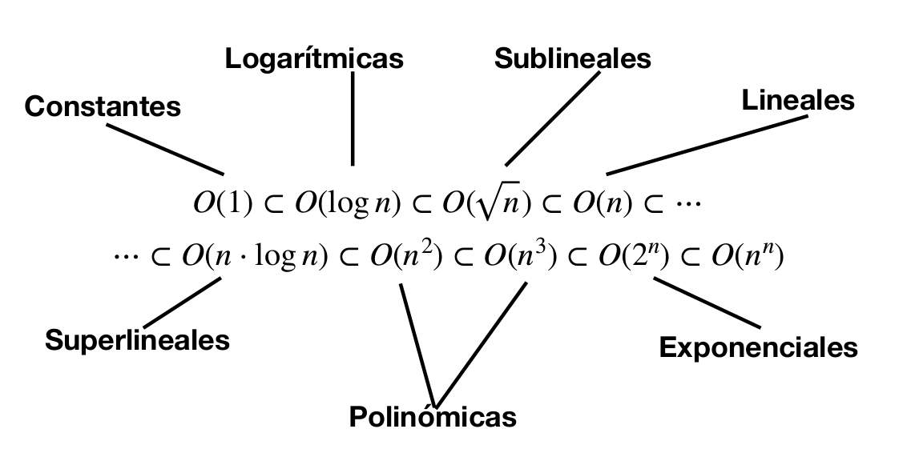

# Eficiencia
## Tamaño del problema
Dados códigos vamos a convertir estos dos códigos en dos funciones que marcarán su eficiencia.
$$n_1\rightarrow f_1(n)$$
$$n_2\rightarrow f_2(n)$$
Para decidir qué código es más eficiente vamos a comparar las funciones obtenidas.
Una comparativa estándar de las funciones de eficiencia sería:
$$log_2 n < n < nlog_2 n < n^2 < n^3 < 2^n$$

## Estudio experimental
Se escribe el programa  y se mide con distintos datos el tiempo que tarda en ejecutarse. Recogemos los datos y con un ajuste se escoge la función que mejor se ajuste.
Esto tiene varias desventajas:

- Para medir el tiempo siempre se debe medir en el mismo ordenador.
- Los datos son limitados, necesitamos todas las entradas.

Por lo tanto, realizaremos un estudio teórico.

## Estudio teórico

### Familias de órdenes de eficiencia

No importa lo que  ocurra con constantes o términos menos significativos, si no el término de mayor grado y, por tanto, importarán las familias de eficiencia a las que pertenezca.

- n: lineal.
- n^2^: Cuadrático.
- n^k^: (con k número natural) polinómico.
- log~a~n: Logarítmico.
- c^n^: Exponencial.

### Comparación de órdenes de eficiencia

Dadas dos funciones, nos quedaremos con la menor según el orden que hay arriba a pesar de que para datos pequeños una función sea más grande que otra, solo nos preocuparemos de datos grandes a la hora de compararlos.
Dadas dos funciones f(n) y g(n) decimos que f(n) es O(g(n)) si, y solo si, f(n) < cg(n) para n>n~0~ con c y n~0~ constantes.
Por ejemplo: (n+1)^2^ es O(n^2^) con n~0~=1 y c=4
Otro ejemplo: 3n^3^+2n^2^ es O(n^3^) con n~0~=0 y c= 5
otro ejemplo: 225 es O(1)

### Jerarquía de funciones



### Reglas simples

- Transitividad:
$$f(n)\rightarrow O(g(n)) ; g(n) \rightarrow O(h(n)) \longrightarrow f(n) \rightarrow O(h(n))$$
- Polinomios: $$a_dn^d+\cdots+a_1n+a_0 \longrightarrow O(n^d)$$
- Jerarquía de funciones:
$$n+log_2n\longrightarrow O(n)$$
$$2^n+n^3\longrightarrow O(2^)$$
- Bases y potencias de logaritmos pueden ignorarse:
$$log_an\longrightarrow O(log_bn)$$
$$log(n^2)\longrightarrow O(logn)$$
- Bases y potencias de exponentes no pueden ignorarse:
$$3^n\not\rightarrow O(2^n)$$
$$a^{n^2} \not\rightarrow O(a^n)$$

### Elección del mejor algoritmo
En la práctica debemos tener en cuenta varios factores:

- Tamaño de los problemas a resolver.
- Requisitos de espacio y tiempo del sistema.
- Complejidad de instalación y mantenimiento de los algoritmos.

Un algoritmo cuadrático puede ser mejor que uno lineal si:

- El tamaño de los problemas a resolver no va a pasar de 100 (constante multiplicativa).
- El algoritmo lineal tiene unos requerimientos de memoria superiores.
- El algoritmo lineal tiene costes de mantenimiento superiores a los del algoritmo cuadrático.

### Notación O
Estas reglas se usan para calcular todos los códigos iterativos (no los recursivos)
- Regla de la suma: Sean T~1~(n) y T~2~(n) los tiempos de dos trozos de código tales que T~1~(n) es O(f(n)) y T~2~(n) es O(g(n))). Entonces T~1~(n)+T~2~(n) es de orden O(max{f(n), g(n)})
- Regla del producto:  Sean T~1~(n) y T~2~(n) los tiempos de dos trozos de código tales que T~1~(n) es O(f(n)) y T~2~(n) es O(g(n))). Si ninguna de ellas es negativa, entonces T~1~(n)T~2~(n) es de orden O(f(n)g(n))

### Calcular la eficiencia
#### Casos simples
Para sacar la función de un código:

- Operación elemental: Operación de un algoritmo cuyo tiempo de ejecución se puede acotar superiormente por una constante. Por ejemplo una asignación, sumas, productos, entradas y salidas.
- Estructura secuencial: O entra el *if* o entra el *else*, mido la eficiencia del código del if y del else por separado, y el rendimiento es el máximo  de la función del *if* y el *else*
- Estructura iterativa:  Debemos tener en cuenta la inicialización, evaluación de condición y actualización. y se suma.
Ejemplo:
```cpp
for (i = 0; i < n; i++)
	A[i][j] = 0;
```
Una asignación: 1
Una condición: 1
En cada iteración tengo una indexación, una asignación, un incremento y una evaluación de condición: 4n
1+1+4n
luego este for es del orden O(n)
Otro ejemplo: Bucles homogéneos
```cpp
for (i = 0; i < n; i++)
	for (j = 0; j< n; j++)
		A[i][j] = 0;
```
Este código es O(n^2^), un n por cada for.
Ejemplo:
```cpp
k= 0;
while (k < n && A[k]!= z)
	k++;
```
En el peor de los casos se hace n veces, y es lo que contaremos.

> ¡Hay más ejemplos en las diapositivas a mano!

#### Con funciones
- Debemos mirar el coste de una llamada a función y seguir contando la eficiencia.

Las funciones de librerías se saben cuanto cuesta cada vez que haces una llamada, lo pone en la función.

#### Con bucles no homogéneos
- Se debe contar las iteraciones en el peor caso.
```cpp
for (i = 0; i < n; i++)
	min = i
	for (j = i+1; j < n+1; j++)
	//mas código, irrelevante porque es de O(1)
```
El segundo for tiene orden O(n-i). Ahora sumo:
$$\Sigma_{i=0}^{n-1} n-i = \Sigma_{i=0}^{n-1} n - \Sigma_{i=0}^{n-1} i =$$
$$= n^2 - \frac{n(n+1)}{2} = \frac{2n^2 -n^2-n}{2} = \frac{n^2-n}{2} \rightarrow O(n^2)$$
El orden es O(n^2).
> ¡Hay más ejemplos en las diapositivas a mano!

#### Cálculo de eficiencia en códigos recursivos

En el caso del factorial, si n=1 entonces vale T(n)=1 y si n>1 entonces su eficiencia es 1*T(n-1).
$$T(n) = 1+ T(n-1)  \forall n> 1 tq T(n) = 1 y T(n) = 0$$
Ahora resolvemos la recurrencia.
$$\forall n>i T(n) = i+T(n-i)$$
$$T(n)=(n-1)+T(n-(n-1))=n-1+T(1)=$$
$$n-1+1=n$$

> Esto no viene en las transparencias, solo se explicó en clase.
